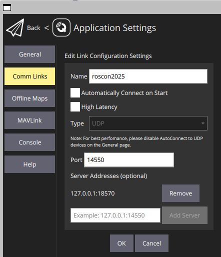

# Development in Docker

A dockerfile is provided to allow running PX4-SITL, GZ HARMONIC and ROS 2 Humble nodes.

The ROS 2 workspace is based on the `ros:humble-perception` image. On top of it the workspace `px4_ros_ws` (`/home/$USER/px4_ros_ws`) contains the main PX4 dependencies:

- Micro-XRCE-DDS-Agent
- px4_msg
- px4-ros2-interface-lib

Gazebo Harmonic is installed and the ros-gz packages are also installed.

## Prerequisites

- AMD64 host architecture.
- [Docker](https://www.docker.com/) installed on Host.

### System setup on WSL2

On W11 WSL2 you can either install Docker desktop on W11 or docker engine directly on WSL, these instructions follow the second approach.

1. **Install Ubuntu 24.04 on WSL2**. Follow the [official instructions](https://learn.microsoft.com/en-us/windows/wsl/install) to install Ubuntu 24.04 on W11 WSL2.

    ```sh
    wsl.exe --install Ubuntu-24.04
    ```

2. **Install docker engine on Ubuntu-24.04**. Docker engine installation instructions are the same for WSL 2 and native Ubuntu. Please got to the instructions for Ubuntu host.

### System setup on Ubuntu

1. **Install docker engine on Ubuntu-24.04**.

    1. Install using the `apt` repository

        ```sh
        # Add Docker's official GPG key:
        sudo apt-get update
        sudo apt-get install ca-certificates curl
        sudo install -m 0755 -d /etc/apt/keyrings
        sudo curl -fsSL https://download.docker.com/linux/ubuntu/gpg -o /etc/apt/keyrings/docker.asc
        sudo chmod a+r /etc/apt/keyrings/docker.asc

        # Add the repository to Apt sources:
        echo \
        "deb [arch=$(dpkg --print-architecture) signed-by=/etc/apt/keyrings/docker.asc] https://download.docker.com/linux/ubuntu \
        $(. /etc/os-release && echo "${UBUNTU_CODENAME:-$VERSION_CODENAME}") stable" | \
        sudo tee /etc/apt/sources.list.d/docker.list > /dev/null
        sudo apt-get update
        sudo apt-get install docker-ce docker-ce-cli containerd.io docker-buildx-plugin docker-compose-plugin
        ```

    2. Verify the installation

        ```sh
        sudo docker run hello-world
        ```

    3. Run docker as non-root user

        ```sh
        sudo usermod -aG docker $USER
        ```

    4. Verify that you can run docker commands without sudo

        ```sh
        docker run hello-world
        ```

    For further information regarding docker installation, please refer to the [official documentation](https://docs.docker.com/engine/install/ubuntu/). For the security risks involved in in running docker as non-root user please refer to [Manage Docker as a non-root user](https://docs.docker.com/engine/install/linux-postinstall/#manage-docker-as-a-non-root-user).

2. **Install QGroundControl**. QGC can either run on the Host and connect to PX4 running in the container or it can directly run in the container. If you plan to run your container in headless mode, then you will need to use the first approach.

    - **Install QGC on the host system**. Please follow the [official instructions](https://docs.qgroundcontrol.com/master/en/qgc-user-guide/getting_started/download_and_install.html#ubuntu) to install QGC on Ubuntu.

        1. Enable serial-port access Add your user to the dialout group so you can talk to USB devices without root. Please note that this is not strictly necessary as QGC will only use UDP connection for the workshop.

            ```sh
            sudo usermod -aG dialout "$(id -un)"
            ```

        2. (Optional) Disable ModemManager On some Ubuntu-based systems, ModemManager can claim serial ports that QGC needs. If you don't use it elsewhere, mask or remove it.

            ```sh
            # preferred: stop and mask the service
            sudo systemctl mask --now ModemManager.service

            # or, if you’d rather remove the package
            sudo apt remove --purge modemmanager
            ```

        3. On the command prompt, enter:

            ```sh
            sudo apt install gstreamer1.0-plugins-bad gstreamer1.0-libav gstreamer1.0-gl -y
            sudo apt install libfuse2 -y
            sudo apt install libxcb-xinerama0 libxkbcommon-x11-0 libxcb-cursor-dev -y
            ```

        4. Now you can download [QGroundControl-x86_64.AppImage](https://d176tv9ibo4jno.cloudfront.net/latest/QGroundControl-x86_64.AppImage).
        5. Make the AppImage executable

            ```sh
            chmod +x QGroundControl-x86_64.AppImage
            ```

    - **Configure the host to run GQC inside the container**. No extra steps are required.

## Building the container

The container can be build by running

```sh
cd roscon-25-workshop
./docker/docker_build_amd64.sh
```

## Running the container

The container can either run with GUI access or in headless mode. The following steps have been tested on both WSL2 and Ubuntu24 hosts.

### Running with GUI

You can run the container with GUI enabled with

```sh
./docker/docker_run.sh
```

The script will:

- Start and run a container from `px4/roscon-25-workshop` image.
- Name it `px4-roscon-25`.
- Ensure that GUI can be used from inside the container.
- Mount the `roscon-25-workshop/px4_roscon_25` folder in `~/roscon-25-workshop_ws/src/`.

### Running with GUI within WSL2

When running withing WSL2, please use instead

```sh
./docker/docker_run_wsl.sh
```

### Running headless

You can run the container in headless mode with

```sh
./docker/docker_run_nogui.sh
```

The script will:

- Start and run a container from `px4/roscon-25-workshop` image.
- Name it `px4-roscon-25`.
- Mount the `roscon-25-workshop/px4_roscon_25` folder in `~/roscon-25-workshop_ws/src/`.
- Expose the udp port `18570` outside the container so that a QGC instance running on the host can connect to PX4 running in the container.

## Starting PX4 simulation

To start the PX4 simulation with Gazebo Harmonic you have to separately spin up a gazebo world. First start the container with `docker_run.sh` or `docker_run_nogui.sh` or open an new terminal in the container if it is already running.

GZ server and GZ GUI client are started with

```sh
python3 /home/ubuntu/PX4-gazebo-models/simulation-gazebo --model_store /home/ubuntu/PX4-gazebo-models/
```

make sure to run the above command inside the container started with `docker_run.sh`

The expected output is

```sh
ubuntu@fe14532c7704:~$ python3 /home/ubuntu/PX4-gazebo-models/simulation-gazebo --model_store /home/ubuntu/PX4-gazebo-models/
Found: 219 files in /home/ubuntu/PX4-gazebo-models/
Models directory not empty. Overwrite not set. Not downloading models.
> Launching gazebo simulation...
QStandardPaths: XDG_RUNTIME_DIR not set, defaulting to '/tmp/runtime-ubuntu'
[Err] [SystemLoader.cc:92] Failed to load system plugin [libOpticalFlowSystem.so] : Could not find shared library.
[Err] [SystemLoader.cc:92] Failed to load system plugin [libGstCameraSystem.so] : Could not find shared library.
```

Please ignore the error messages about the plugins not found.
The gazebo client windows will open on the empty world.
No PX4 model will appear.
This is normal as PX4 instance and model will be spawned later.


If instead you only want to run the GZ server, then run

```sh
python3 /home/ubuntu/PX4-gazebo-models/simulation-gazebo --model_store /home/ubuntu/PX4-gazebo-models/ --headless
```

The expected output is

```sh
ubuntu@1bcab3a5e820:~$ python3 /home/ubuntu/PX4-gazebo-models/simulation-gazebo --model_store /home/ubuntu/PX4-gazebo-models/ --headless
Found: 219 files in /home/ubuntu/PX4-gazebo-models/
Models directory not empty. Overwrite not set. Not downloading models.
> Launching gazebo simulation...
[Err] [SystemLoader.cc:92] Failed to load system plugin [libOpticalFlowSystem.so] : Could not find shared library.
[Err] [SystemLoader.cc:92] Failed to load system plugin [libGstCameraSystem.so] : Could not find shared library.
```

Please ignore the error messages about the plugins not found.

Once GZ server is running you can start a PX4 instance and spawn the model in Gazebo.
Please run the following command on the host: a new terminal inside the container will be opened and the right PX4 startup command issued

```sh
docker exec -it px4-roscon-25 /bin/bash -c "PX4_GZ_STANDALONE=1 PX4_SYS_AUTOSTART=4001 PX4_SIM_MODEL=gz_x500 /home/ubuntu/px4_sitl/bin/px4 -w /home/ubuntu/px4_sitl/romfs"
```

The expected output is

```sh
$ docker exec -it px4-roscon-25 /bin/bash -c "PX4_GZ_STANDALONE=1 PX4_SYS_AUTOSTART=4001 PX4_SIM_MODEL=gz_x500 /home/ubuntu/px4_sitl/bin/px4 -w /home/ubuntu/px4_sitl/romfs"
INFO  [px4] assuming working directory is rootfs, no symlinks needed.

______  __   __    ___ 
| ___ \ \ \ / /   /   |
| |_/ /  \ V /   / /| |
|  __/   /   \  / /_| |
| |     / /^\ \ \___  |
\_|     \/   \/     |_/

px4 starting.

INFO  [px4] startup script: /bin/sh etc/init.d-posix/rcS 0
env SYS_AUTOSTART: 4001
INFO  [param] selected parameter default file parameters.bson
INFO  [param] selected parameter backup file parameters_backup.bson
  SYS_AUTOCONFIG: curr: 0 -> new: 1
  SYS_AUTOSTART: curr: 0 -> new: 4001
  CAL_ACC0_ID: curr: 0 -> new: 1310988
  CAL_GYRO0_ID: curr: 0 -> new: 1310988
  CAL_ACC1_ID: curr: 0 -> new: 1310996
  CAL_GYRO1_ID: curr: 0 -> new: 1310996
  CAL_ACC2_ID: curr: 0 -> new: 1311004
  CAL_GYRO2_ID: curr: 0 -> new: 1311004
  CAL_MAG0_ID: curr: 0 -> new: 197388
  CAL_MAG0_PRIO: curr: -1 -> new: 50
  CAL_MAG1_ID: curr: 0 -> new: 197644
  CAL_MAG1_PRIO: curr: -1 -> new: 50
  SENS_BOARD_X_OFF: curr: 0.0000 -> new: 0.0000
  SENS_DPRES_OFF: curr: 0.0000 -> new: 0.0010
INFO  [dataman] data manager file './dataman' size is 1208528 bytes
INFO  [init] Gazebo simulator
INFO  [init] Standalone PX4 launch, waiting for Gazebo
INFO  [init] Waiting for Gazebo world...
INFO  [init] Waiting for Gazebo world...
INFO  [init] Gazebo world is ready
INFO  [init] Spawning model
INFO  [gz_bridge] world: default, model: x500_0
INFO  [lockstep_scheduler] setting initial absolute time to 2324000 us
INFO  [commander] LED: open /dev/led0 failed (22)
WARN  [health_and_arming_checks] Preflight Fail: ekf2 missing data
WARN  [health_and_arming_checks] Preflight Fail: No connection to the ground control station
INFO  [uxrce_dds_client] init UDP agent IP:127.0.0.1, port:8888
INFO  [tone_alarm] home set
INFO  [mavlink] mode: Normal, data rate: 4000000 B/s on udp port 18570 remote port 14550
INFO  [mavlink] mode: Onboard, data rate: 4000000 B/s on udp port 14580 remote port 14540
INFO  [mavlink] mode: Onboard, data rate: 4000 B/s on udp port 14280 remote port 14030
INFO  [mavlink] mode: Gimbal, data rate: 400000 B/s on udp port 13030 remote port 13280
INFO  [logger] logger started (mode=all)
INFO  [logger] Start file log (type: full)
INFO  [logger] [logger] ./log/2025-08-09/11_56_59.ulg
INFO  [logger] Opened full log file: ./log/2025-08-09/11_56_59.ulg
INFO  [mavlink] MAVLink only on localhost (set param MAV_{i}_BROADCAST = 1 to enable network)
INFO  [mavlink] MAVLink only on localhost (set param MAV_{i}_BROADCAST = 1 to enable network)
INFO  [px4] Startup script returned successfully
pxh> WARN  [health_and_arming_checks] Preflight Fail: No connection to the ground control station
WARN  [health_and_arming_checks] Preflight Fail: No connection to the ground control station
```

Unless you are running headless, you will see the `x500` model spawned in the GZ world.


**PX4 requires GCS connection to arm**.

If you started the container with `./docker/docker_run.sh` then you can start QGC by running following command on the host

```sh
docker exec -it px4-roscon-25 /bin/bash -c "/home/ubuntu/QGroundControl/qgroundcontrol"
```

On the PX4 terminal you will see the message

```sh
INFO  [mavlink] partner IP: 127.0.0.1
INFO  [commander] Ready for takeoff!
```

Please ignore any extra error messages.

Now you can plan a mission on QGC and execute it.

If instead you're running the container without GUI, then QGC must run on the host and in order for it to connect PX4 a custom UPD link needs to be crated. Add a server with ip `127.0.0.1` and port set to `18570`.



On the PX4 terminal you will see the message

```sh
INFO  [mavlink] partner IP: 172.17.0.1
INFO  [commander] Ready for takeoff!
```

## Developing

When the image is build, the content of `roscon-25-workshop/px4_roscon_25` is automatically copied into `/home/${USER}/roscon-25-workshop_ws/src`. The `roscon-25-workshop/px4_roscon_25` is the source folder for any ROS 2 package you which to build and right now it only contains a dummy package.

If you change your packages and you want to re-build them connect to the running container and run

```sh
cd ~/roscon-25-workshop_ws
colcon build --symlink-install
```
