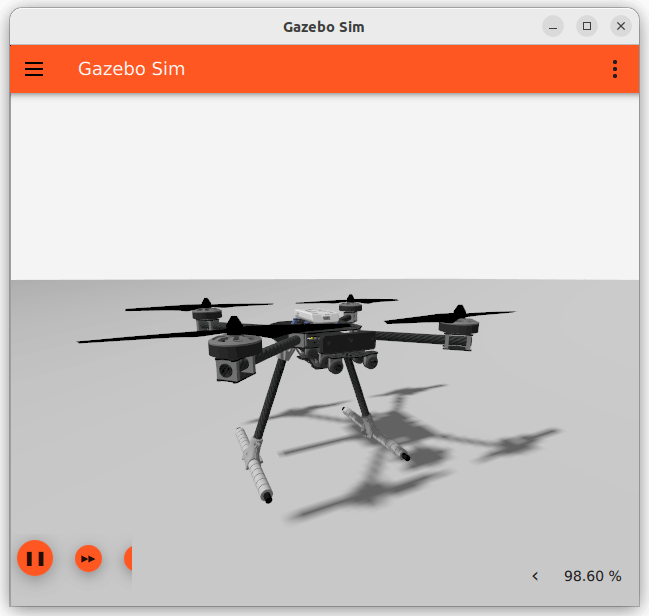
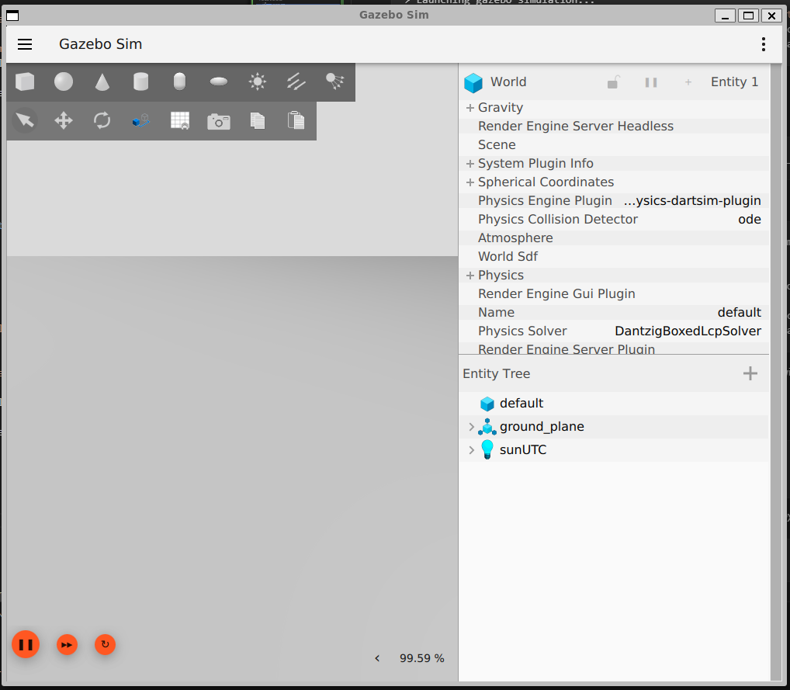
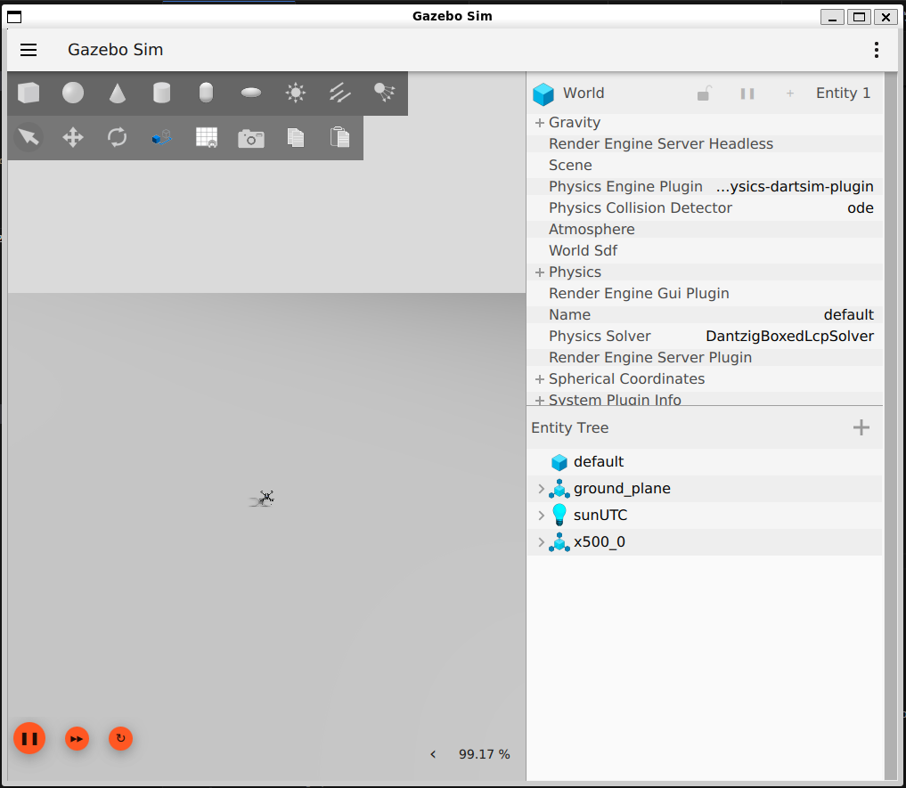

# Setup

This page will guide you through the installation of the requirements for running the workshop exercises and it will explain how ROS 2, Gazebo and PX4 will interact.

The images contains all the required dependencies for the workshop, in particular:

- [GZ HARMONIC](https://gazebosim.org/docs/harmonic/getstarted/)
- [ROS 2 Humble](https://docs.ros.org/en/humble/index.html)
- [PX4](https://github.com/PX4/PX4-Autopilot) v1.16.0 simulator

To further simplify working in the container, VSCode [devcontainers]() are provided.

## Prerequisites

The easiest way to start using and testing the ROS 2 packages made for this workshop is through the available AMD64 and ARM64 Docker containers.
For this reason, the rest of the document will assume that Docker is used and therefore [Docker](https://www.docker.com/) is the only mandatory requirement.

Please [install Docker](https://docs.docker.com/engine/install/) following the appropriate instruction for your system architecture.
Prerequisites installation instructions are also available in [docs/prerequisites.md](./prerequisites.md).
Then verify the installation by pulling the latest workshop docker image:

```sh
docker pull dronecode/roscon-25-workshop:latest
```

All exercises can be run with or without GUI.
GUI is recommended as it allows:

- to use the Gazebo client and observe the drones move inside the simulator,
- to start QGroundControl directly from inside the container.

### Using the GUI in Docker

Successfully using GUI applications in Docker can be tricky as the setup heavily depends on your Host system.
GUI has been successfully tested on Ubuntu 24.04 running with and without Nvidia drivers and on W11 WSL2 running with Nvidia drivers.

- If your host is Ubuntu and you don't have Nvidia drivers + [NVIDIA Container Toolkit](https://docs.nvidia.com/datacenter/cloud-native/container-toolkit/latest/install-guide.html) installed, then you can either:
  - Start the container with

    ```sh
    ./docker/docker_run.sh
    ```
  
  - Develop with the devcontainer `.devcontainer/linux/devcontainer.json`.
- If instead you have nvidia drivers and the NVIDIA Container Toolkit installed, then you can either:
  - Start the container with

    ```sh
    ./docker/docker_run.sh --nvidia
    ```
  
  - Develop with the devcontainer `.devcontainer/nvidia/devcontainer.json`.
- Finally, if you the above solutions do not work for you or you're host is running on Apple, then you can either:
  - Start the container with

    ```sh
    ./docker/docker_run.sh --no-gui
    ```
  
  - Develop with the devcontainer `.devcontainer/nogui/devcontainer.json`.

## Container structure

- Most of the required ROS 2 packages are installed through the available binaries:
  - [GZ HARMONIC](https://gazebosim.org/docs/harmonic/getstarted/)
  - [ROS 2 Humble](https://docs.ros.org/en/humble/index.html)
- Those packages that cannot be installed through binaries and that are dependencies for the main workshop exercise packages are source installed in `/home/${USER}/px4_ros_ws/install`:

  - [Micro-XRCE-DDS-Agent](https://github.com/eProsima/Micro-XRCE-DDS-Agent) version 2.4.2
  - [PX4 msgs](https://github.com/PX4/px4_msgs) version 1.16
  - [PX4 ROS 2 Interface Library](https://github.com/Auterion/px4-ros2-interface-lib)
  - `ros_gz`

  Because one of the workshop exercises depends on OpenCV 4.10, `OpenCV`, `ros-humble-vision-opencv` and `ros-humble-image-common` are source installed too.

- [PX4 v1.16.0](https://px4.io/) simulator and its supported GZ Harmonic models and worlds.
- [GGroundControl](https://qgroundcontrol.com/), The Ground Control Station that interacts with PX4.

### PX4 SITL

The docker image contains the binaries for running PX4 on linux, to interface it with Gazebo and all Gazebo models and worlds that support PX4.
The binaries are compiled in specific layer and to reduce the container size, only the final executables are copied in the final image.

Please refer to [docs/customize_px4.md](./customize_px4.md) to know how to use a custom version of PX4.

### QGroundControl

QGC v5.0.8 Linux Appimage is added and then extracted during the compilation of the docker AMD64 image.
If you're running on AMD64 with GUI, then you can open QGC directly from inside the container.

If instead you're running without GUI, then both docker_run script and the devcontainer allow you to connect PX4 to QGC running on the host.

## Test it out

Before jumping in into the exercises, the setup can be validated.

First of all the container needs to be started.
There are two proposed ways to do this: through VSCode devcontainers or with pure Docker commands.

### Starting the container with pure Docker commands

This mode does not require VSCode.
On the other hand it is slightly less user friendly as you'll have to open multiple terminals inside the container.

You can use

```sh
./docker/docker_run.sh
```

The script will start the container and attach a shell to it.
You can use also use two options:

- `--no-gui` to disable GUI in the container,
- `--nvidia` to run the container with the `nvidia` runtime (it requires the [NVIDIA Container Toolkit](https://docs.nvidia.com/datacenter/cloud-native/container-toolkit/latest/install-guide.html) installed on the host).

When using this method you can attach new shell to your container by running

```sh
docker exec -it px4-roscon-25 bash
```

### Starting the container through VSCode devcontainers

To use the devcontainers, simply open the workshop repo in VSCode, then type `CTRL+SHIFT+P` and select `Dev Containers: Reopen in container`. Finally select the devcontainer of your choice.

From now-on, all commands are assumed to be run from a terminal inside the container unless otherwise specified.

### Starting the PX4-GZ simulation

PX4 can directly connect to GZ using the `gz-transport` libraries.
This means that PX4 can control any GZ model as long as the model uses the required sensor and actuation plugins.

For this workshop we will use the x500 quadrotor model.



The PX4 Gazebo worlds and models are available in the `/home/ubuntu/PX4-gazebo-models` container directory.
From there you can start a GZ simulation with a PX4 compatible world:

```sh
python3 /home/ubuntu/PX4-gazebo-models/simulation-gazebo --model_store /home/ubuntu/PX4-gazebo-models/ --world default
```

If you want to run the gz server in headless mode, add the option `--headless`.
If you want to change the world, then change the argument of `--world`.

Note that `--headless` is mandatory when running without GUI.

The expected output when GUI is enabled is

```sh
ubuntu@fe14532c7704:~$ python3 /home/ubuntu/PX4-gazebo-models/simulation-gazebo --model_store /home/ubuntu/PX4-gazebo-models/
Found: 219 files in /home/ubuntu/PX4-gazebo-models/
Models directory not empty. Overwrite not set. Not downloading models.
> Launching gazebo simulation...
QStandardPaths: XDG_RUNTIME_DIR not set, defaulting to '/tmp/runtime-ubuntu'
[Err] [SystemLoader.cc:92] Failed to load system plugin [libOpticalFlowSystem.so] : Could not find shared library.
[Err] [SystemLoader.cc:92] Failed to load system plugin [libGstCameraSystem.so] : Could not find shared library.
```

Please ignore the error messages about the plugins not found.
The gazebo client windows will open on the empty world.
No PX4 model will appear.
This is normal as PX4 instance and model will be spawned later.



Once the GZ server is running, you can spawn the `x500` model and attach a PX4 instance to it with

```sh
PX4_GZ_STANDALONE=1 PX4_SYS_AUTOSTART=4001 PX4_PARAM_UXRCE_DDS_SYNCT=0 /home/ubuntu/px4_sitl/bin/px4 -w /home/ubuntu/px4_sitl/romfs
```

The expected output is

```sh
$ PX4_GZ_STANDALONE=1 PX4_SYS_AUTOSTART=4001 PX4_SIM_MODEL=gz_x500 PX4_PARAM_UXRCE_DDS_SYNCT=0 /home/ubuntu/px4_sitl/bin/px4 -w /home/ubuntu/px4_sitl/romfs
INFO  [px4] assuming working directory is rootfs, no symlinks needed.

______  __   __    ___ 
| ___ \ \ \ / /   /   |
| |_/ /  \ V /   / /| |
|  __/   /   \  / /_| |
| |     / /^\ \ \___  |
\_|     \/   \/     |_/

px4 starting.

INFO  [px4] startup script: /bin/sh etc/init.d-posix/rcS 0
env SYS_AUTOSTART: 4001
INFO  [param] selected parameter default file parameters.bson
INFO  [param] selected parameter backup file parameters_backup.bson
  SYS_AUTOCONFIG: curr: 0 -> new: 1
  SYS_AUTOSTART: curr: 0 -> new: 4001
  CAL_ACC0_ID: curr: 0 -> new: 1310988
  CAL_GYRO0_ID: curr: 0 -> new: 1310988
  CAL_ACC1_ID: curr: 0 -> new: 1310996
  CAL_GYRO1_ID: curr: 0 -> new: 1310996
  CAL_ACC2_ID: curr: 0 -> new: 1311004
  CAL_GYRO2_ID: curr: 0 -> new: 1311004
  CAL_MAG0_ID: curr: 0 -> new: 197388
  CAL_MAG0_PRIO: curr: -1 -> new: 50
  CAL_MAG1_ID: curr: 0 -> new: 197644
  CAL_MAG1_PRIO: curr: -1 -> new: 50
  SENS_BOARD_X_OFF: curr: 0.0000 -> new: 0.0000
  SENS_DPRES_OFF: curr: 0.0000 -> new: 0.0010
  UXRCE_DDS_SYNCT: curr: 1 -> new: 0
INFO  [dataman] data manager file './dataman' size is 1208528 bytes
INFO  [init] Gazebo simulator
INFO  [init] Standalone PX4 launch, waiting for Gazebo
INFO  [init] Gazebo world is ready
INFO  [init] Spawning model
INFO  [gz_bridge] world: default, model: x500_0
INFO  [lockstep_scheduler] setting initial absolute time to 2324000 us
INFO  [commander] LED: open /dev/led0 failed (22)
WARN  [health_and_arming_checks] Preflight Fail: ekf2 missing data
WARN  [health_and_arming_checks] Preflight Fail: No connection to the ground control station
INFO  [uxrce_dds_client] init UDP agent IP:127.0.0.1, port:8888
INFO  [tone_alarm] home set
INFO  [mavlink] mode: Normal, data rate: 4000000 B/s on udp port 18570 remote port 14550
INFO  [mavlink] mode: Onboard, data rate: 4000000 B/s on udp port 14580 remote port 14540
INFO  [mavlink] mode: Onboard, data rate: 4000 B/s on udp port 14280 remote port 14030
INFO  [mavlink] mode: Gimbal, data rate: 400000 B/s on udp port 13030 remote port 13280
INFO  [logger] logger started (mode=all)
INFO  [logger] Start file log (type: full)
INFO  [logger] [logger] ./log/2025-08-09/11_56_59.ulg
INFO  [logger] Opened full log file: ./log/2025-08-09/11_56_59.ulg
INFO  [mavlink] MAVLink only on localhost (set param MAV_{i}_BROADCAST = 1 to enable network)
INFO  [mavlink] MAVLink only on localhost (set param MAV_{i}_BROADCAST = 1 to enable network)
INFO  [px4] Startup script returned successfully
pxh> WARN  [health_and_arming_checks] Preflight Fail: No connection to the ground control station
WARN  [health_and_arming_checks] Preflight Fail: No connection to the ground control station
```

Let's analyze this command:

- `PX4_GZ_STANDALONE=1` tells the PX4 startup script that it no gz-server needs to start: one is already running.
- `PX4_SYS_AUTOSTART=4001` tells the PX4 startup script that it has to use the `4001` _airframe_.
This frame is defined in the [PX4 simulated airframes](https://github.com/PX4/PX4-Autopilot/tree/v1.16.0/ROMFS/px4fmu_common/init.d-posix/airframes) folder and is bound to the `x500` model.
- `PX4_PARAM_UXRCE_DDS_SYNCT=0` disabled the time synchronization feature between ROS 2 and PX4.
Synchronization is not needed as Gazebo will control the clock for both PX4 and ROS 2.

The complete documentation for running PX4 simulation in Gazebo is part of [PX4 documentation](https://docs.px4.io/main/en/sim_gazebo_gz/).



Before taking off you just need to connect QGC to your simulated drone.
If you started you container with the GUI, then you can simply run

```sh
/home/ubuntu/QGroundControl/qgroundcontrol
```

If instead you don't have GUI in your container, then you can still run QGC on the host and attach it to the simulated PX4 instance.

To do so, first [install QGC](https://docs.qgroundcontrol.com/Stable_V5.0/en/qgc-user-guide/getting_started/download_and_install.html), then start it and create a custom UDP connection link setting the server ip to `127.0.0.1` and the port to `18570`.
The no-gui container automatically exposed the udp port `18570` to the host.

On the PX4 terminal you will see the message

```sh
INFO  [mavlink] partner IP: 172.17.0.1
INFO  [commander] Ready for takeoff!
```

### Linking the simulation to ROS 2

ROS 2 needs to interact with both Gazebo and PX4.
Gazebo interaction is necessary for clock synchronization while PX4 interaction allows to read PX4 data in ROS 2 and to send commands from ROS 2 to PX4.
This latter interaction is completely independent from Gazebo and lets you connect to PX4 from ROS 2 when PX4 runs on a real flight controller.

We will use the `ros_gz_bridge` package to create an unidirectional bridge between the gz `/clock` topic and the ROS 2 one.
This will allow our nodes to run with the parameter `use_sim_time=true`.

```sh
ros2 run ros_gz_bridge parameter_bridge /clock@rosgraph_msgs/msg/Clock[gz.msgs.Clock
```

Now we can [bridge PX4 and ROS 2](https://docs.px4.io/main/en/ros2/).
This is done through [eProsima Micro XRCE-DDS](https://micro-xrce-dds.docs.eprosima.com/en/v2.4.3/) which lets PX4 messages to be directly exposed to the ROS 2 network.
The simulated PX4 instance automatically start the Micro XRCE-DDS client using UDP protocol on port 8888, what we need to do is to just start the agent with the same settings.

```sh
MicroXRCEAgent udp4 -p 8888
```

### Inspecting PX4 messages

Now that the PX4 messages are available to ROS 2, you can list them with

```sh
ros2 topic list
```

The messages in the topics with namespace `/fmu/in` are sent from ROS 2 to PX4 while the ones with namespace `/fmu/out` go from PX4 to ROS 2.

For example, you can check the PX4 vehicle status with

```sh
ros2 topic echo /fmu/out/vehicle_status_v1
```

### Foxglove visualization

You can use the `px4_tf` packages, in conjunction with `foxglove_bridge` to visualize in 3D the drone `base_link`.

The `px4_tf_publisher` node subscribes to PX4 `/fmu/out/vehicle_odometry` topic and publishes a derived transform for the `odom` frame to the `base_link` frame.

```sh
ros2 run px4_tf px4_tf_publisher --ros-args -p use_sim_time:=true
```

Finally `foxglove_bridge` let's us visualize the tf in Foxglove.

```sh
ros2 run foxglove_bridge foxglove_bridge --ros-args -p use_sim_time:=true
```

## Troubleshooting

### T1: Gazebo GUI not showing

A1: Make sure you're running the container with GPU support.

### T2: on WSL2 I'm getting `docker: Error response from daemon: error gathering device information while adding custom device "/dev/dri": no such file or directory`

A2: Only `./docker/docker_run.sh --nvidia` combined with NVIDIA Container Toolkit works out of the box on WSL2.
If you don't have nvidia drivers or NVIDIA Container Toolkit installed on WSL2 you can run it headless `./docker/docker_run.sh --no-gui` or you can try removing `DOCKER_CMD="$DOCKER_CMD --device /dev/dri:/dev/dri"` from `./docker/docker_run.sh`.
