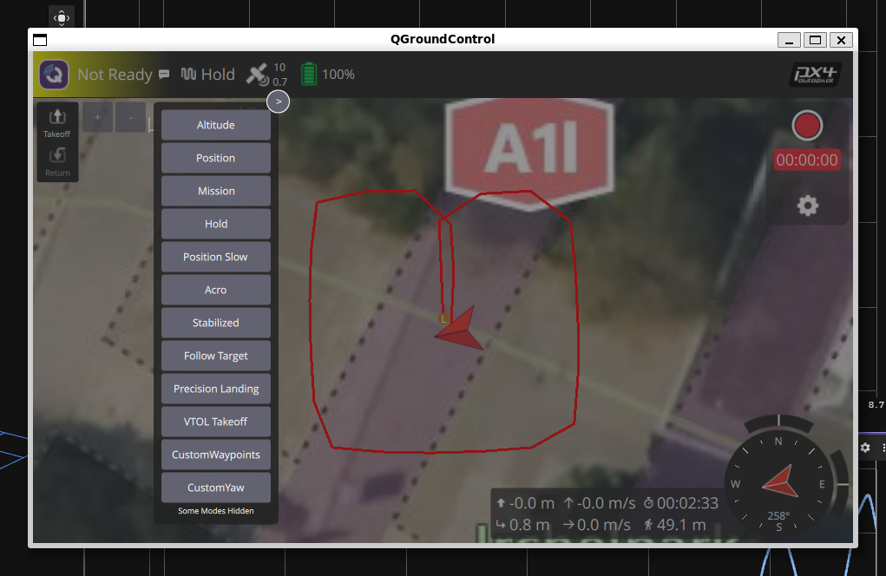
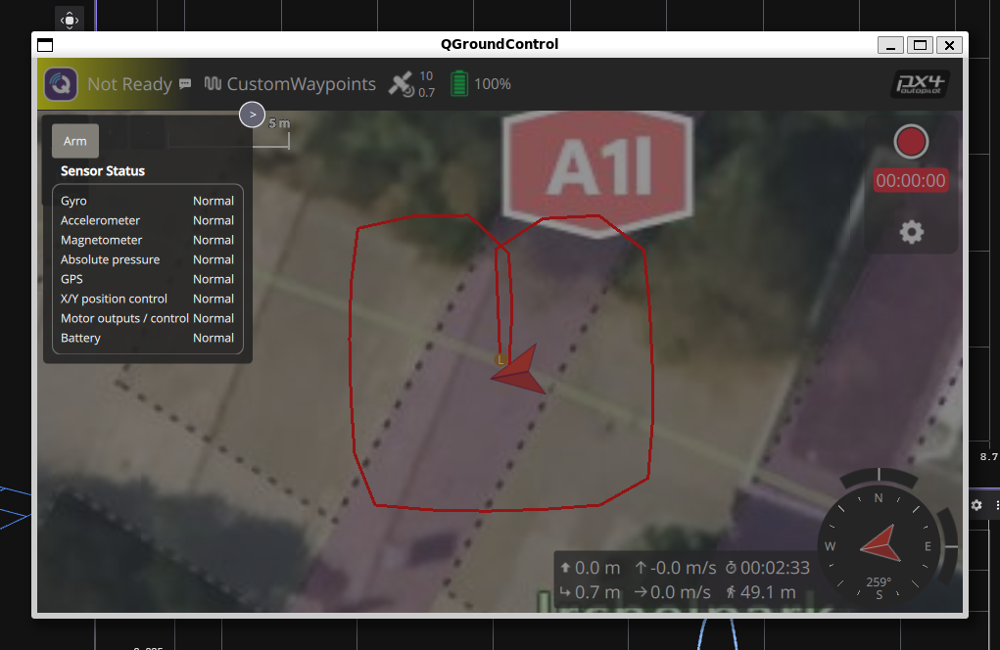

# Custom Mode Demo

This package demonstrates how to create and use PX4 custom flight modes from ROS 2 using the PX4-ROS2 Interface Library. It showcases the implementation of custom flight behaviors that integrate seamlessly with PX4's mode management system.

## Overview

The Custom Mode Demo implements two custom flight modes using the PX4-ROS2 Interface Library:

1. **CustomWaypoints Mode**: Autonomous waypoint navigation with predefined trajectory
2. **CustomYaw Mode**: Controlled yaw rotation while maintaining position

These modes are orchestrated by a **CustomModeExecutor** that manages the complete flight sequence through a state machine architecture.
You have to select CustomWaypoints for the sequence to start.

### Flight Sequence

The demo executes the following autonomous sequence:

1. **Takeoff** - Automatic takeoff to predefined altitude
2. **CustomWaypoints** - Navigate through rectangular waypoint pattern
3. **CustomYaw** - Perform 360-degree rotation while hovering
4. **Land** - Automatic landing
5. **WaitUntilDisarmed** - Safe completion state

## Prerequisites

1. Start the simulation, PX4 and QGC as described in the [setup guide](../../docs/setup.md).
2. Ensure the vehicle is armed (GPS lock, all sensors healthy)
3. Verify QGroundControl connection for mode monitoring

## Usage

1. Start the simulation, PX4 and QGC as described in the [setup guide](../../docs/setup.md).
2. Start the additional ROS 2 node through the [common launchfile](../px4_roscon_25/README.md)

   ```sh
   ros2 launch px4_roscon_25 common.launch.py
   ```

3. Run `custom_mode_demo.launch.py` from inside the docker container

   ```sh
   ros2 launch custom_mode_demo custom_mode_demo.launch.py
   ```

4. Differently from the Offboard control exercise, the custom mode demo does not automatically switch to the correct external mode _CustomWaypoints_ and it does not arm the drone.

   1. On the QGC window, fist enter _CustomWaypoints_ mode:

      

   2. Then click on the `Not Ready` label and arm the vehicle:

      

The `custom_mode_demo.launch.py` can also start the _MicroXrceAgent_ and the _gz clock bridge_. Set the launch arguments `run_uxrcedds_agent` or `run_gz_clock_bridge` to `true` to run them if you don't use  `common.launch.py`.

## Exercises

1. Add any kind of parameter, that affects CustomWaypoint or CustomYaw
2. Explore what happens if you want to change the Mode order in the Executor
3. Add another Mode after yaw, where you change the altitude to 3 m before landing

The solution to the exercise is commented out at the end of the `CustomMode.cpp`, `CustomMode.hpp`, `CustomModeExecutor.cpp` and `CustomModeExecutor.hpp`
Feel free to uncomment it and recompile the package to unveil it.
