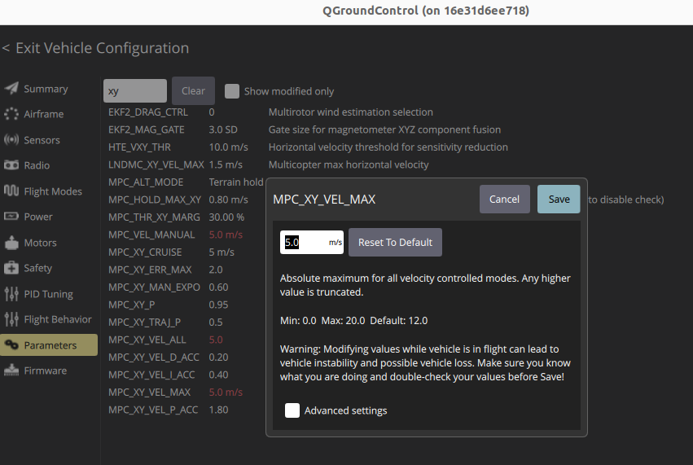

# Precision Landing with Executor Demo

This package demonstrates how to create and use PX4 custom flight modes from ROS 2 using the PX4-ROS2 Interface Library.
It showcases the implementation of custom waypoints and precision landing behaviors that integrate seamlessly with PX4's mode management system.

## Overview

The Precision Landing Executor Demo implements two custom flight modes using the PX4-ROS2 Interface Library:

1. **CustomWaypoints Mode**: Autonomous waypoint navigation with predefined trajectory
2. **PrecisionLand Mode**: Precision landing using visual target tracking

These modes are orchestrated by an **Executor** that manages the complete flight sequence through a state machine architecture.
You have to select CustomWaypoints for the sequence to start.

### Flight Sequence

The demo executes the following autonomous sequence:

1. **Takeoff** - Automatic takeoff to predefined altitude
2. **CustomWaypoints** - Navigate through rectangular waypoint pattern
3. **PrecisionLand** - Perform precision landing using visual guidance
4. **WaitUntilDisarmed** - Safe completion state

## Precision Landing

The precision landing mode demonstrates autonomous landing using visual target detection and tracking.
The system:

- Detects visual landing targets (ArUco markers or other fiducials)
- Calculates precise position corrections relative to the target
- Executes controlled descent while maintaining position over the target
- Provides smooth and accurate landing on the designated target

## Prerequisites

1. Start the simulation, PX4 and QGC as described in the [setup guide](../../docs/setup.md) with the `walls` world and the x500 with the downfacing camera:

   ```sh
   python3 /home/ubuntu/PX4-gazebo-models/simulation-gazebo --model_store /home/ubuntu/PX4-gazebo-models/ --world walls
   ```

   ```sh
   PX4_GZ_STANDALONE=1 PX4_SYS_AUTOSTART=4014 PX4_PARAM_UXRCE_DDS_SYNCT=0 /home/ubuntu/px4_sitl/bin/px4 -w /home/ubuntu/px4_sitl/romfs
   ```

2. Ensure the vehicle is ready (GPS lock, all sensors healthy)
3. Verify QGroundControl connection for mode monitoring
4. Set up visual landing target in the simulation environment

## Usage

The current waypoints require a velocity limit, you can set it in QGC.



1. Launch the common launchfile

   ```sh
   ros2 launch px4_roscon_25 common.launch.py
   ```

2. Start the ArUco tracker node:

   ```sh
   ros2 launch aruco_tracker aruco_tracker.launch.py world_name:=walls model_name:=x500_mono_cam_down_0
   ```

3. Run `precision_land_executor.launch.py` from inside the docker container

   ```sh
   ros2 launch precision_land_executor precision_land_executor.launch.py
   ```

4. Select **CustomWaypoints** and arm the drone
