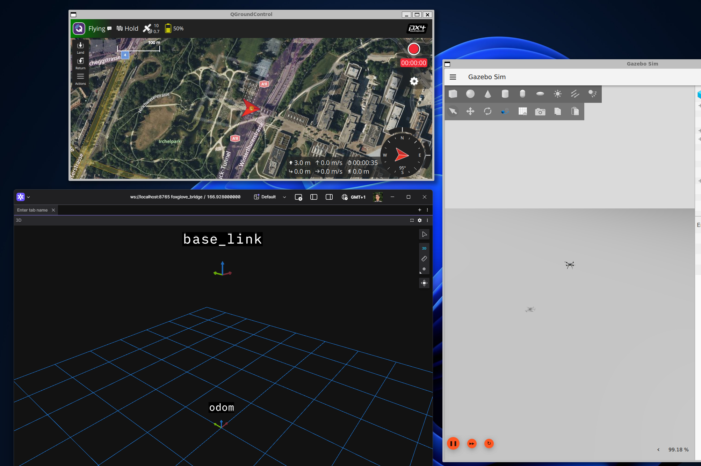
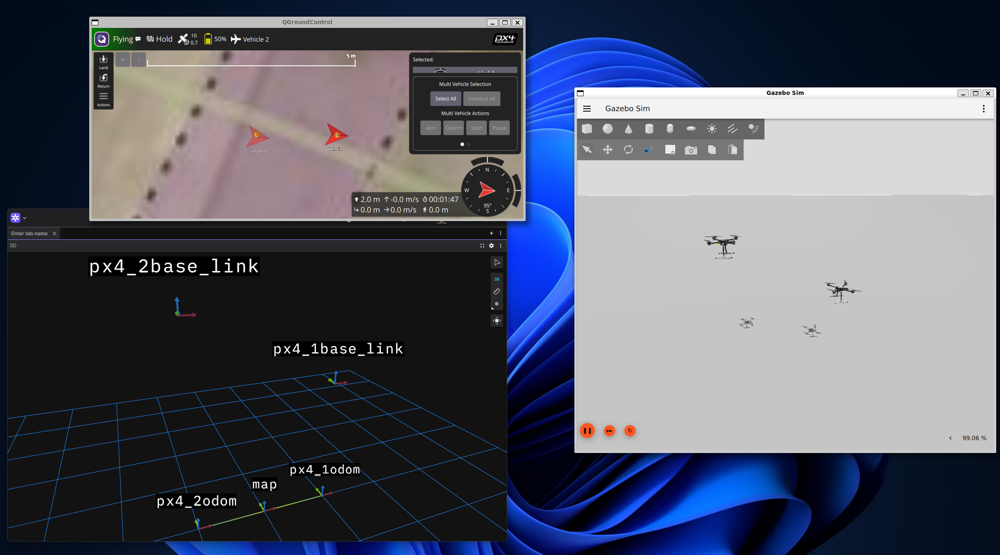

# PX4 TF

This utility package simplify tf generation from PX4 data.

## `px4_tf_publisher`

The `px4_tf_publisher` node subscribes to the `fmu/out/vehicle_odometry` PX4 message (type `px4_msgs::msg::VehicleOdometry`) and republish its content as ROS 2 transform.

This node shall be used when communication with a PX4 drone through the [uXRCE-DDS bridge](https://docs.px4.io/main/en/middleware/uxrce_dds.html)

The tf sequence is as follow:

`odom` -> `odom_ned` -> `base_link_frd` -> `base_link`

- An optional suffix can be added to all four frames through the parameter `px4_tf_prefix`.
- `odom` -> `odom_ned` is a static TF. `odom` uses the ROS 2 ENU convention.
- `base_link_frd` -> `base_link` is a static TF. `base_link` uses the ROS 2 FLU convention.

## About PX4 `vehicle_odometry`

PX4 `vehicle_odometry` message contains the PX4 estimated position and orientation of the drone. The estimation is performed by PX4 [EKF2](https://docs.px4.io/main/en/advanced_config/tuning_the_ecl_ekf.html) library and it combines together data coming from different sensors such as GPS modules, IMU and magnetometers.

Contrarily to ROS 2, PX4 uses _NED_ (North, East, Down) and _FRD_ (Front, Right, Down) coordinate systems which are usually adopted in drones and aeronautics communities.
In order to be used in ROS, fixed frames using NED convention must be converted into _ENU_ (East, North, Up) and frames using FRD convention must be converted into _FLU_ (Front, Left, Up).
This is accomplished by `px4_tf_publisher` static tf publishers.

PX4 odometry position matches the PX4 `local_position`.
This position data becomes valid as soon as the PX4 estimator initialization ends and valid position data is fused.
Valid position data sources are: GNSS sensors, external odometry sources (vision-base odometry) and optical flow sensors.
Because this is a local position in PX4 reference frame, its initial value is always zero.
This means that the user is responsible for setting up transforms between PX4 reference frame (the`odom` frame) and any other frame used in the specific application.

When GPS and magnetometers are used (either in real vehicles or in simulation), then PX4 yaw angle is zero if the vehicle is facing North and increases when rotating clockwise.
When converted in ROS 2 coordinate system this corresponds to a yaw value of `90deg` while orienting a PX4 drone such that its ROS 2 yaw value is zero, i.e. it is facing East, will correspond to a PX4 yaw of `90deg`.

## Examples

The following examples assumes that the user can run a PX4 simulation using Gazebo and can bridge PX4 and ROS 2 through uXRCE-DDS.
All the commands that follows are expected to be run from inside the workshop container assuming the GUI is available.
Please refer to the [docker guide](../../docker/README.md) for running the commands without GUI.

### Example 1 - single drone spawning in Gazebo position (0,0,0)

When a single drone is simulated and the drone is spawned in the Gz world in position (0,0,0), then the node can be used without additional commands.
Please run the following commands in separate terminals.

1. Start Gazebo, spawn a drone and attach a PX4 instance to it.
   1. Start Gazebo:

      ```sh
      python3 /home/ubuntu/PX4-gazebo-models/simulation-gazebo --model_store /home/ubuntu/PX4-gazebo-models/
      ```

   2. Spawn a `x500` quadrotor model in gz position (0,0,0) facing gz x-axis (ROS 2 East):

      ```sh
      PX4_GZ_STANDALONE=1 PX4_SYS_AUTOSTART=4001 PX4_SIM_MODEL=gz_x500 PX4_PARAM_UXRCE_DDS_SYNCT=0 /home/ubuntu/px4_sitl/bin/px4 -w /home/ubuntu/px4_sitl/romfs
      ```

   3. Start QGC:

      ```sh
      /home/ubuntu/QGroundControl/qgroundcontrol
      ```

2. Start the MicroXRCE Agent

   ```sh
   MicroXRCEAgent udp4 -p 8888
   ```

3. Use `ros_gz_bridge` to bridge gz `/Clock` topic

   ```sh
   ros2 run ros_gz_bridge parameter_bridge /clock@rosgraph_msgs/msg/Clock[gz.msgs.Clock
   ```

4. Start `px4_tf_publisher`

   ```sh
   ros2 run px4_tf px4_tf_publisher --ros-args -p use_sim_time:=true
   ```

5. Use Foxglove to visualize your data, first start the foxglove bridge

   ```sh
   ros2 run foxglove_bridge foxglove_bridge --ros-args -p use_sim_time:=true
   ```

   Then open Foxglove client, select a 3D panel, set `odom` as reference frame and toggle on the visualization of `base_link` frame.

   

### Example 2 - two drones

1. Start Gazebo, spawn a drone and attach a PX4 instance to it.
   1. Start Gazebo:

      ```sh
      python3 /home/ubuntu/PX4-gazebo-models/simulation-gazebo --model_store /home/ubuntu/PX4-gazebo-models/
      ```

   2. Spawn a `x500` quadrotor model in gz position (1,0,0) facing gz x-axis (ROS 2 East). Instance id is set to 1 (`-i 1`) to ensure unique namespace for the px4_topics

      ```sh
      PX4_GZ_STANDALONE=1 PX4_SYS_AUTOSTART=4001 PX4_SIM_MODEL=gz_x500 PX4_GZ_MODEL_POSE="1,0,0,0,0,0" PX4_PARAM_UXRCE_DDS_SYNCT=0 /home/ubuntu/px4_sitl/bin/px4 -w /home/ubuntu/px4_sitl/romfs -i 1
      ```

   3. Spawn a second `x500` quadrotor model in gz position (-11,0,0) facing gz x-axis (ROS 2 East). Instance id is set to 2 (`-i 2`) to ensure unique namespace for the px4_topics

      ```sh
      PX4_GZ_STANDALONE=1 PX4_SYS_AUTOSTART=4001 PX4_SIM_MODEL=gz_x500 PX4_GZ_MODEL_POSE="-1,0,0,0,0,0" PX4_PARAM_UXRCE_DDS_SYNCT=0 /home/ubuntu/px4_sitl/bin/px4 -w /home/ubuntu/px4_sitl/romfs -i 2
      ```

   4. Start QGC:

      ```sh
      /home/ubuntu/QGroundControl/qgroundcontrol
      ```

2. Start the MicroXRCE Agent

   ```sh
   MicroXRCEAgent udp4 -p 8888
   ```

3. Use `ros_gz_bridge` to bridge gz `/Clock` topic

   ```sh
   ros2 run ros_gz_bridge parameter_bridge /clock@rosgraph_msgs/msg/Clock[gz.msgs.Clock
   ```

4. Start two `px4_tf_publisher` instances, one for each vehicle.

   ```sh
   ros2 run px4_tf px4_tf_publisher --ros-args -p use_sim_time:=true -r __ns:=/px4_1 -p px4_tf_prefix:=px4_1
   ```

   ```sh
   ros2 run px4_tf px4_tf_publisher --ros-args -p use_sim_time:=true -r __ns:=/px4_2 -p px4_tf_prefix:=px4_2
   ```

5. Start two static tf publishers to link `px4_1odom` and `px4_2odom` to a common `map` frame

   ```sh
   ros2 run tf2_ros static_transform_publisher --x 1 --y 0 --z 0 --yaw 0 --pitch 0 --roll 0 --frame-id map --child-frame-id px4_2odom
   ```

   ```sh
   ros2 run tf2_ros static_transform_publisher --x -1 --y 0 --z 0 --yaw 0 --pitch 0 --roll 0 --frame-id map --child-frame-id px4_2odom
   ```

6. Use Foxglove to visualize your data, first start the foxglove bridge

   ```sh
   ros2 run foxglove_bridge foxglove_bridge --ros-args -p use_sim_time:=true
   ```

   Then open Foxglove client, select a 3D panel, set `odom` as reference frame and toggle on the visualization of `base_link` frame.

   
